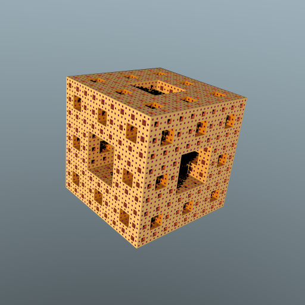

# Fractals plugin for Brayns

## Description

The Fractals Renderer plugin allows visualization of 3D fractals, and is implemented as a plugin for [Blue Brain Brayns](https://github.com/BlueBrain/Brayns), the Blue Brain rendering platform.

## Usage

- Point LD_LIBRARY_PATH to the folder which contains
  'libbraynsFractals.so'
- Run Brayns application either with command line '--plugin braynsFractals --module fractals'

## Screenshots

## Contact

For more information on the Black Hole Renderer plugin, please contact:

__Cyrille Favreau__  
[cyrille.favreau@gmail.com](cyrille.favreau@gmail.com) 
